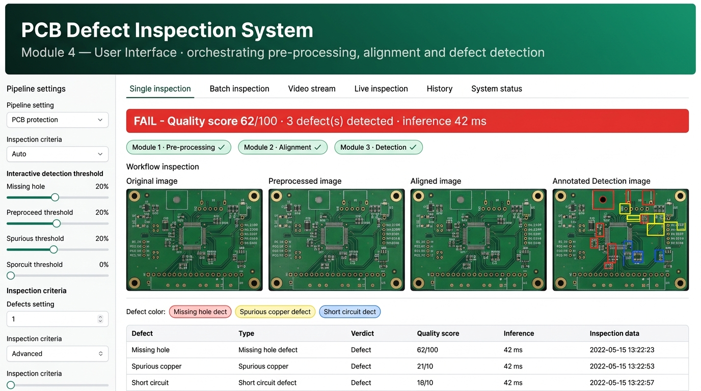
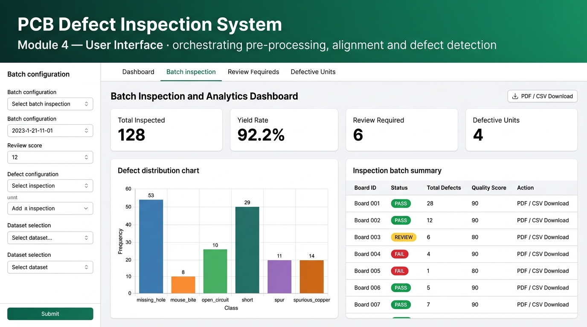
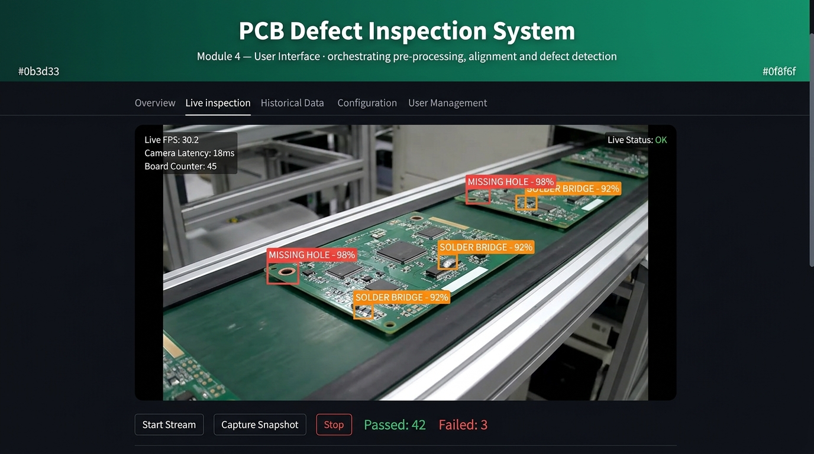
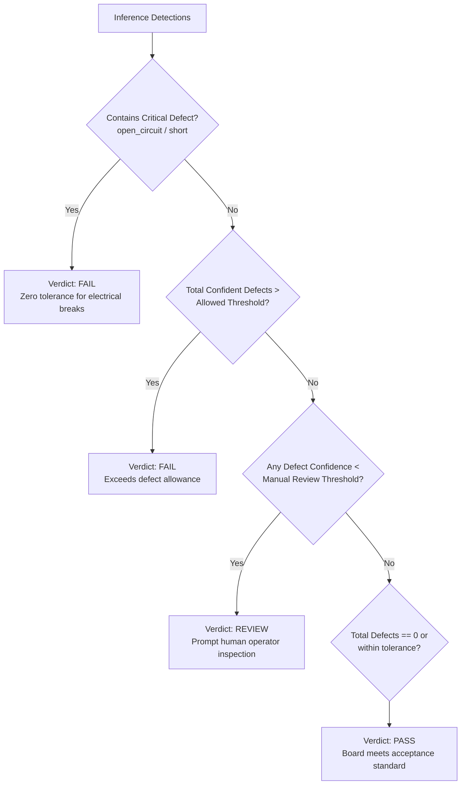

# PCB Defect Inspection System — Frontend & Operator UI Module

<div align="center">


<br/>

**BMDS2133 Image Processing · Assignment Mode B (Innovative Solution Development)**  
*Module 4: Operator-Facing User Interface, Orchestration, Analytics & Reporting*

</div>

---

## 📌 Executive Summary

**Module 4 (Frontend UI)** is the central operator console and orchestration nerve center for the automated PCB defect inspection system. It bridges and orchestrates the complete machine vision lifecycle by coordinating:
1. **Module 1**: Image Acquisition & Quality Enhancement (Pre-processing)
2. **Module 2**: Perspective Correction & Geometric Alignment
3. **Module 3**: Deep Learning Defect Detection (YOLOv10 / RT-DETR / Faster R-CNN)
4. **Module 4 (This Repo)**: Multi-Stage Visual Presentation, Acceptance Decision Engine, Real-time Stream Analytics, Persistent Storage (SQLite/Supabase), and Formal Report Certification (PDF/CSV).

The frontend is architected around **strict separation of concerns** and **adapter patterns**. It performs zero algorithmic image manipulation directly; instead, it provides an industrial-grade, zero-crash responsive interface that dynamically communicates with upstream modules over standardized HTTP REST APIs or offline local bridges.

---

## 🖼️ UI Showcase & Visual Highlights

The user interface follows a modern industrial aesthetic with an emerald theme (`#0b3d33` to `#0f8f6f`), calm contrast surfaces, unambiguous status chips, and real-time visual feedback.

### 1. Single Board Inspection & Multi-Stage Pipeline View
> Comprehensive single-board diagnostics showing real-time verdict, quality scoring, pipeline stage chips, and side-by-side progression from raw input to annotated defect detection.

<div align="center">
  
</div>

* **Coloured Verdict Banner**: Prominent visual indicator (`PASS` in emerald green, `REVIEW` in amber, `FAIL` in crimson) with composite quality score (0–100) and defect count.
* **Pipeline Stage Progress Chips**: Shows real-time execution status of upstream stages: `Module 1 · Pre-processing ✓`, `Module 2 · Alignment ✓`, and `Module 3 · Detection ✓`.
* **4-Way Comparative Display**: Synchronized rendering of **Original RAW**, **Pre-processed**, **Aligned**, and **Annotated Detection** images.
* **Interactive Defect Legend**: Color-coded badges mapping defect categories directly to bounding boxes and frequency counters.

---

### 2. Batch Inspection & Yield Analytics Dashboard
> High-throughput batch processing for entire folders or multi-file uploads with yield analytics, defect distribution charting, and export tools.

<div align="center">
  
</div>

* **Production Yield KPI Metrics**: Real-time summary tiles highlighting **Total Inspected**, **Yield Rate (%)**, **Review Required**, and **Defective Units**.
* **Defect Distribution Histogram**: Aggregate frequency bar chart categorizing defect classes across the entire inspection run.
* **Audit Inspection Table**: Tabular findings detailing Board ID, status badges, defect breakdown, quality scores, and per-board quick actions.
* **Instant Export Suite**: One-click generation of formal **PDF Batch Inspection Certificates** and structured **Pandas CSV Data Logs**.

---

### 3. Real-Time Camera & Conveyor Video Stream Inspection
> Low-latency real-time video stream inspection designed for factory conveyor environments, supporting continuous camera input and video replay.

<div align="center">
  
</div>

* **Live Video Processing**: Dynamic boundary tracking and high-speed defect inference on conveyor belt feeds.
* **Hardware & Stream Health Telemetry**: Live overlay of **Effective FPS**, **Camera Latency (ms)**, **Unit Counter**, and **Stream Status**.
* **Dual Capture Modes**:
  - **Continuous Stream**: High-throughput OpenCV capture loop optimized with non-blocking chunked re-runs.
  - **Browser Snapshot**: Built-in zero-driver camera capture using `st.camera_input` for remote operators.

---

## 🎨 Design System & Visual Hierarchy

The interface design adheres to strict industrial human-factor guidelines to minimize operator fatigue while highlighting actionable anomalies:

| Design Token | Hex Code | Visual Application | Semantic Meaning |
|---|---|---|---|
| `--pcb-accent` | `#0f8f6f` | Header gradients, active tabs, buttons | System Brand & Vitality |
| `--pcb-header-bg` | `#0b3d33` → `#0f8f6f` | Top Banner linear gradient | Application Identity Band |
| `--pcb-pass` | `#27ae60` | Banner, metric text, badges | Clean Board / Accepted (PASS) |
| `--pcb-review` | `#f39c12` | Banner, warnings, amber chips | Borderline / Manual Check (REVIEW) |
| `--pcb-fail` | `#c0392b` | Banner, critical alerts, red badges | Rejected / Critical Defect (FAIL) |
| `--pcb-surface` | `#ffffff` | Card surfaces, modals, tables | Clean Readability Surface |
| `--pcb-ink` | `#1f2937` | Primary text and headings | High-Contrast Typography |
| `--pcb-muted` | `#6b7280` | Labels, captions, secondary units | Subdued Metadata |

### Defect Class Chromatic Legend
To ensure bounding boxes remain sharp against green solder masks, defects are mapped to dedicated high-visibility colors:
* 🔴 **Missing Hole (`missing_hole`)**: `#e74c3c` (Bright Red)
* 🟠 **Mouse Bite (`mouse_bite`)**: `#f39c12` (Amber Orange)
* 🟣 **Open Circuit (`open_circuit`)**: `#9b59b6` (Vivid Purple)
* 🔵 **Short (`short`)**: `#3498db` (Cyan Blue)
* 🟢 **Spur (`spur`)**: `#1abc9c` (Teal Green)
* 🟡 **Spurious Copper (`spurious_copper`)**: `#f1c40f` (Golden Yellow)

---

## 🧭 Page Overview & Capabilities

The frontend delivers six specialized operator pages accessible via the primary tab navigation:

```
[ 🔍 Single inspection ] [ 📁 Batch inspection ] [ 🎞 Video stream ] [ 📷 Live inspection ] [ 📋 History ] [ ⚙️ System status ]
```

### 1. 🔍 Single Inspection
* **Ingestion**: Drag-and-drop file uploader, or browse sample boards from the connected project dataset.
* **Validation**: Dual PCB validation mechanism (color saturation check + edge density check) automatically rejects non-PCB uploads before wasting inference cycles.
* **Stage-by-Stage Inspector**: Inspect Intermediate stages: Pre-processed, Homography-Aligned, and Object-Detection Bounding Boxes.
* **Defect Findings Table**: Coordinates `(x1, y1, x2, y2)`, confidence score `%`, and calculated pixel area for every detected defect.
* **Reporting**: Download high-resolution annotated image, export full technical PDF inspection certificate with cryptographic hash & metadata.

### 2. 📁 Batch Inspection
* **Folder & Bulk Ingestion**: Ingest multi-image sets or point directly to folder directories recursively.
* **Analytics Engine**: Real-time batch yield rate calculation, failure breakdown pie/bar plots, and worst-performing board ranking.
* **Evidence Gallery**: Visual failure gallery showing only rejected (`FAIL`) or flagged (`REVIEW`) boards for rapid operator review.
* **Data Export**: Export aggregated summary PDF report with an annotated visual appendix, plus raw defect-level CSV logs.

### 3. 🎞 Video Stream Inspection
* **Stream Analytics**: Ingest recorded conveyor belt videos (`.mp4`), sampling frames with configurable stride (*n*-th frame).
* **Frame Tracking & Worst-Frame Snapshot**: Flags the single frame containing the highest defect severity or count for immediate root-cause inspection.
* **Export**: Generates annotated video re-encoded at original frame rate.

### 4. 📷 Live Inspection
* **Snapshot Mode**: Employs WebRTC / HTML5 browser camera input (`st.camera_input`) requiring no physical server-side camera connection.
* **Continuous Stream**: Direct OpenCV loop chunked into 2-second non-blocking intervals to maintain UI responsiveness and immediate `Stop` button handling.
* **Live Counter**: Cumulative count of inspected boards, rolling yield rate, and live defect rate.

### 5. 📋 History & Yield Dashboard
* **Enterprise Persistence**: Connects seamlessly with local **SQLite** or cloud-hosted **Supabase (PostgreSQL)**.
* **Multi-Filter Queries**: Filter past inspection logs by inspection mode, verdict, date range, or model version.
* **Historical Trends**: Time-series charts visualizing quality score drift and yield percentage evolution over time.

### 6. ⚙️ System Status & Diagnostics
* **Service Telemetry**: Live ping and status diagnostics for Module 1 & 2 pipeline service and Module 3 detection inference endpoints.
* **Checkpoint & Hardware Inspector**: Displays loaded weights (`yolov10n`, `rtdetr-l`, `faster_rcnn`), PyTorch execution device (`cuda` / `cpu`), and detected camera peripherals.
* **Environment Manifest**: Full library dependency check (OpenCV, Torch, Ultralytics, Streamlit versions).

---

## ⚖️ Acceptance Criteria & Decision Engine

The UI Module does not merely report bounding boxes; it executes an **industrial rule-based acceptance evaluation**:



### Composite Quality Score Formula
Alongside the verdict, every board receives an objective **Quality Score (0–100)**:
$$\text{Quality Score} = \max\left(0, 100 - \sum_{i} \left(25 \times \text{Severity}_i \times \text{Confidence}_i\right)\right)$$
* Electrical failures (`open_circuit`, `short`) carry highest severity multiplier ($\times 1.0$).
* Cosmetic anomalies (`mouse_bite`, `spur`, `spurious_copper`) carry moderate severity ($\times 0.6 \sim 0.8$).

---

## 🏗️ Architecture & Decoupled Adapters

```
                           ┌─────────────────────────────────────────┐
      Operator ───────────▶│                 app.py                  │  Module 4 (Frontend UI)
      Image / Folder /     │   Streamlit Pages, Routing & State      │
      Video / Camera       └────────────────────┬────────────────────┘
                                                │
          ┌─────────────────────────────────────┼─────────────────────────────────────┐
          ▼                                     ▼                                     ▼
    core/pipeline_remote.py               core/remote.py                       core/analysis.py
  (REST Client :8100)                   (REST Client :8000)                (Acceptance & Quality)
          │            \                      │           \                           │
          │             \                     │            \                          ▼
          ▼              ▼                    ▼             ▼                   Verdict & Score
    ┌───────────┐  ┌───────────┐        ┌───────────┐  ┌───────────┐                  │
    │  Module 1 │  │  Local    │        │  Module 3 │  │  Local    │                  ▼
    │  & 2 API  │  │  Bridge   │        │  FastAPI  │  │ Checkpoint│       core/report.py  → PDF
    └───────────┘  └───────────┘        └───────────┘  └───────────┘       core/storage.py → SQLite/Cloud
     Remote Microservice                  Inference Microservice           core/video.py   → Video MP4
```

### Graceful Degradation Matrix
The UI guarantees **zero unhandled exceptions** if upstream components are absent or degraded:

| Upstream Failure Scenario | Frontend Handling & Operator Notice |
|---|---|
| **Module 1 & 2 API Down / Unreachable** | Bypasses pre-processing/alignment; forwards raw image to detection; sets warning chips and informs operator. |
| **Module 2 Alignment Lost (No 4 Corners)** | Continues inspection on pre-processed frame; stage chip displays `rescaled only` or `not applied`. |
| **Module 3 Inference Down / No Weights** | Disables detection; pre-processing & geometric alignment stay fully operational; displays warning. |
| **Non-PCB Uploaded** | Evaluated by `pcb_check.py` (hue concentration + edge density); instantly rejected as `FAIL` before wasting model cycles. |
| **Database Disconnected** | Gracefully falls back to in-memory session cache; notifications shown without blocking inspection. |
| **No Camera Device Found** | Continuous mode disables capture button with explanatory tooltip; Snapshot mode remains available. |

---

## 🚀 Quick Start Guide

### 1. Installation

```bash
# Clone the frontend repository
git clone https://github.com/leekeezhan/PCB-Defect-UI.git
cd PCB-Defect-UI

# Create and activate Python virtual environment
python -m venv venv
# Windows:
.\venv\Scripts\activate
# Linux/macOS:
source venv/bin/activate

# Install required dependencies
pip install -r requirements.txt
```

### 2. Launching the Operator Interface

```bash
streamlit run app.py
```
Open your browser at `http://localhost:8501`. The frontend starts immediately and is fully interactive even with **zero upstream services running** (utilizing intelligent degradation).

### 3. Running Upstream Services (Optional / Teammate Integration)

To connect with teammate modules or run local mocks:

* **Remote Microservices Mode**:
  Configure URLs in the sidebar:
  - **Processing Pipeline API**: `http://127.0.0.1:8100` ([API Contract Pipeline](docs/API_CONTRACT_PIPELINE.md))
  - **Detection Model API**: `http://127.0.0.1:8000` ([API Contract Detection](docs/API_CONTRACT.md))

* **Local Mock Service (All-in-One Dev Server)**:
  ```bash
  # Launches a reference service answering both contracts on port 8000
  python -m uvicorn local_service.serve:app --host 127.0.0.1 --port 8000
  ```

---

## 📁 Repository Structure

```
PCB-Defect-UI/
├── app.py                      # Application entry point: routing, layout, orchestration
├── requirements.txt            # Dependency manifest (Streamlit, OpenCV, Torch, ReportLab)
├── run_local_service.bat       # Helper script to launch local development server
│
├── ui/                         # UI Presentation Layer
│   ├── theme.py                # CSS injection, color tokens, and header branding
│   ├── sidebar.py              # Consolidated configuration control panel
│   └── components.py           # Reusable UI widgets (banners, chips, legends, metric tiles)
│
├── core/                       # Orchestration & Integration Adapters
│   ├── pipeline_remote.py      # HTTP adapter for Module 1 & 2 pipeline service
│   ├── pipeline_bridge.py      # Local adapter importing shared image_pipeline.py
│   ├── remote.py               # HTTP client for Module 3 defect detection service
│   ├── detector.py             # Local checkpoint inference adapter (Ultralytics / Torchvision)
│   ├── analysis.py             # Acceptance criteria rules, quality scoring, batch aggregations
│   ├── pcb_check.py            # Non-PCB upload rejection heuristics
│   ├── viz.py                  # OpenCV drawing utilities, palette mapping, bounding boxes
│   ├── report.py               # ReportLab PDF engine for single/batch certificates
│   ├── video.py                # Video file frame extractor and defect tracking
│   ├── live.py                 # Live camera capture loop and WebRTC handlers
│   ├── storage.py              # Persistence layer supporting SQLite and Supabase
│   └── workspace.py            # Dynamic dataset resolver and sample locator
│
├── docs/                       # Technical Specifications & Documentation
│   ├── images/                 # High-resolution UI screenshots and visual assets
│   ├── API_CONTRACT.md         # Wire specification for Module 3 detection endpoint
│   ├── API_CONTRACT_PIPELINE.md# Wire specification for Module 1 & 2 pipeline endpoint
│   ├── supabase_schema.sql     # Database schema, indexes, and RLS policies
│   └── supabase_images.sql     # Storage bucket definitions for uploaded assets
│
└── tests/
    └── test_core.py            # Automated backend test suite (177 offline test cases)
```

---

## 🧪 Automated Testing & Verification

The frontend core includes a comprehensive verification suite ensuring high reliability across all components:

```bash
python tests/test_core.py
```

```
================================ test session starts ================================
collected 177 items

tests/test_core.py ........................................................... [ 33%]
............................................................................. [ 75%]
............................................                                  [100%]
================================ 177 passed in 4.82s ================================
```

* **Coverage Highlights**:
  - `AcceptanceCriteria` and quality score calculations under all corner cases.
  - Robustness of `RemotePipeline` and `RemoteDetector` handling HTTP timeouts and malformed responses.
  - Non-PCB heuristics reject non-board images reliably.
  - ReportLab PDF generator produces valid binary PDF documents without missing fonts.
  - SQLite and Supabase serialization and deserialization integrity.

---

## 👥 Contributors & Module Division

* **Module 1**: Image Acquisition & Pre-processing (Denoising, Illumination Correction)
* **Module 2**: Geometric Alignment & Calibration (Corner Detection, Perspective Transform)
* **Module 3**: Deep Learning Defect Detection (Model Training, Checkpoints, Inference API)
* **Module 4 (Frontend)**: **User Interface, Pipeline Orchestration, Visual Analytics & Quality Certification**

---

<div align="center">
  <sub>Developed for BMDS2133 Image Processing · Innovative Solution Development</sub>
</div>
